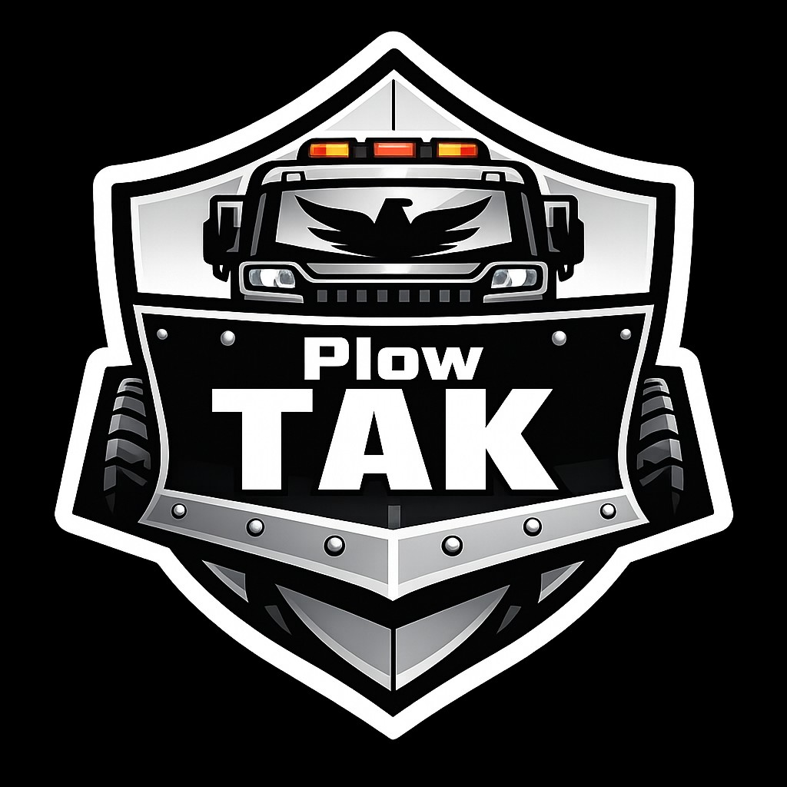
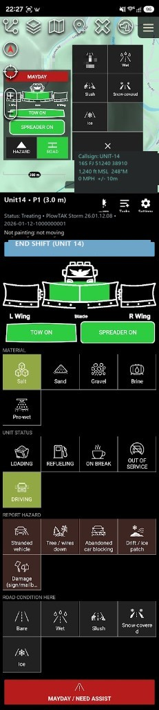
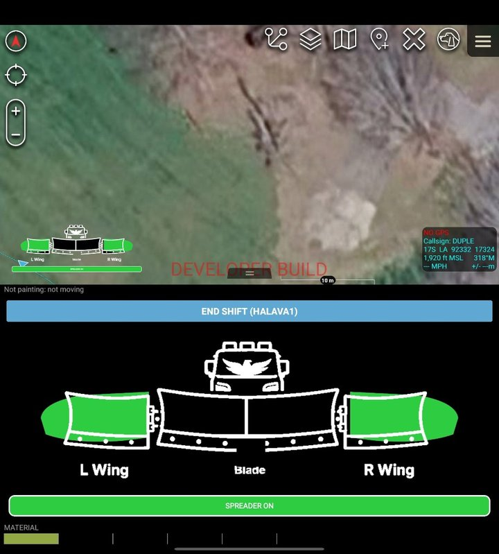
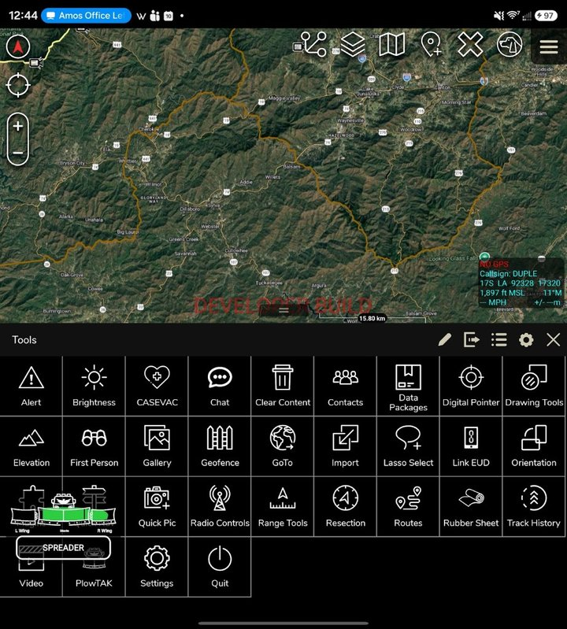
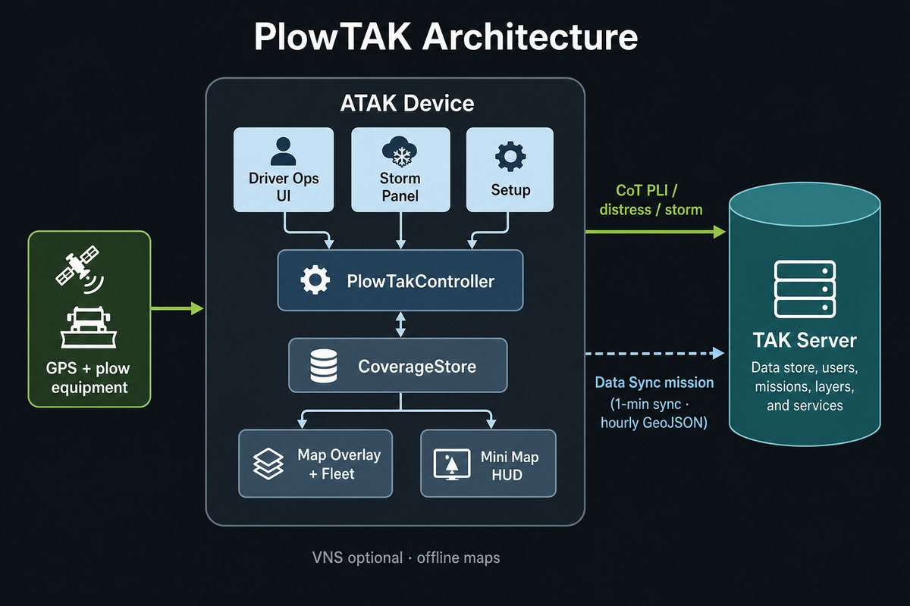
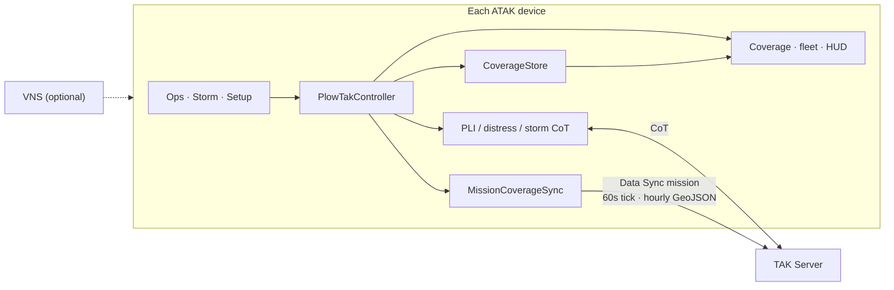
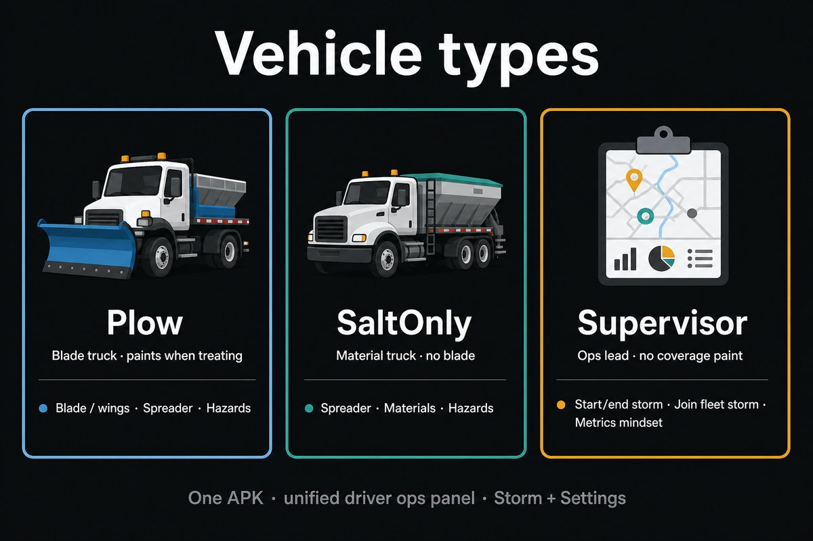
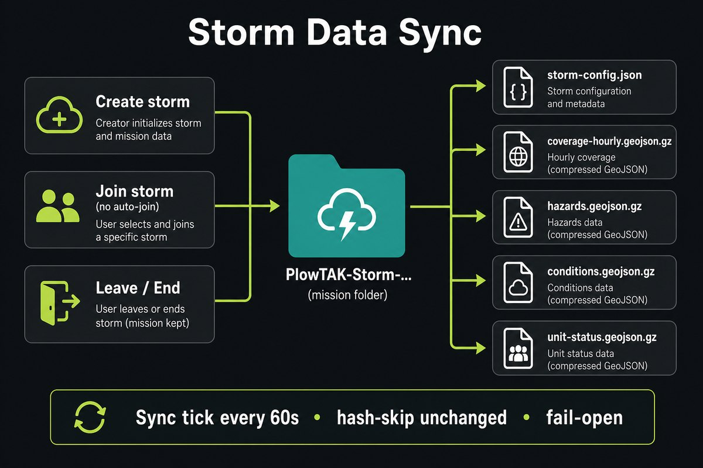
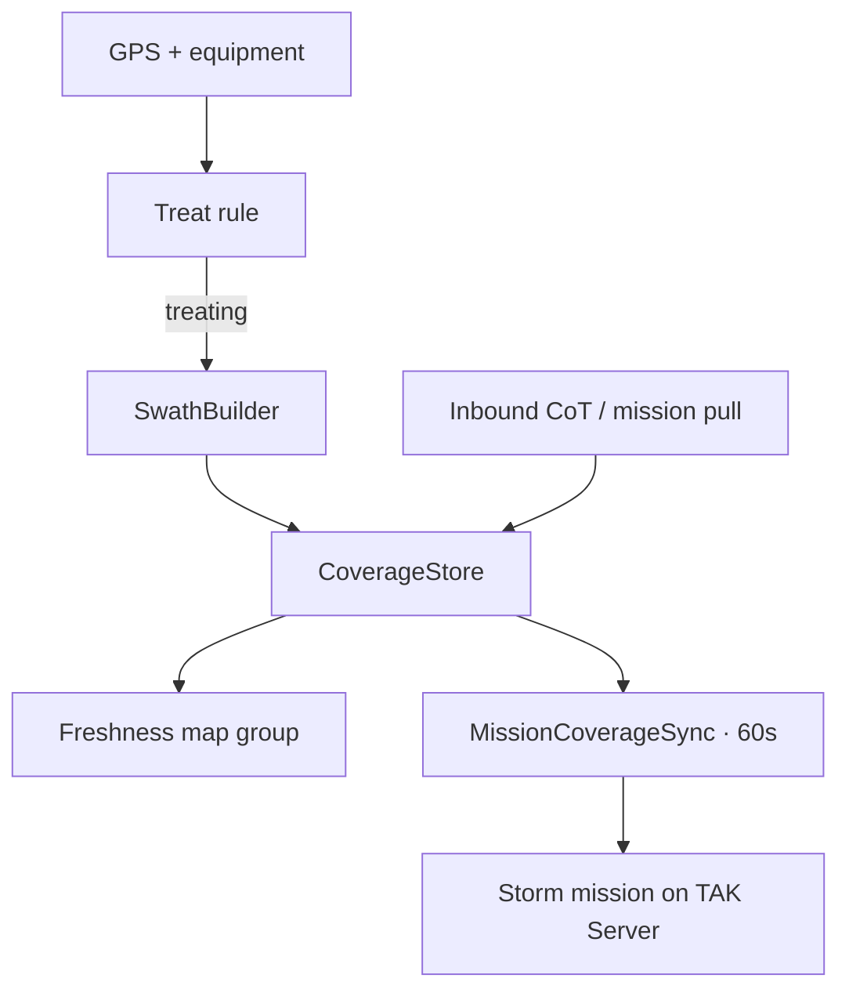
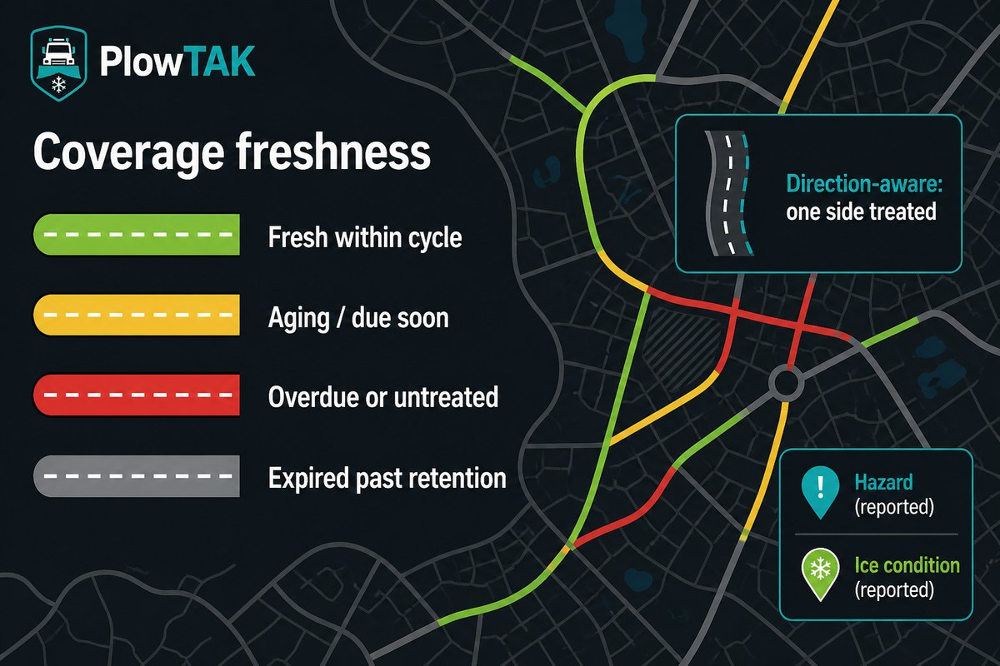

# PlowTAK

<p align="center">
  
</p>

<p align="center">
  
</p>

<p align="center"><em>PlowTAK on ATAK-CIV 5.8 (Fold cover): live map + glove-friendly driver panel.</em></p>

**PlowTAK** is an ATAK plugin for winter road operations — plow fleet coverage,
hazards, road conditions, and storm coordination over TAK Server. Published by
**CopIX**.

**Field install (ATAK-CIV 5.8):** download the latest **TPC-signed** APK from
[Releases / tpc-0.1.6](https://github.com/CopIXus/PlowTAK/releases/tag/tpc-0.1.6),
install, then Plugins → PlowTAK → **Load**. CopIX-only CI builds show
“signature INVALID” on release ATAK — use a `tpc-*` release for Load.

Treat-capable trucks paint where roads were worked; peers on the same TAK
Server see freshness-colored coverage, fleet status, Mayday, hazards, and
conditions. Storms are **joined explicitly** (never auto-joined). Catch-up for
late joiners rides **TAK Data Sync** missions via Marti — the on-device Data
Sync plugin is not required for PlowTAK’s upload path. Offline maps/routing
come from the optional **VNS** plugin.

---

## What’s in the panel

One ops drop-down for every vehicle type, plus **Storm** and **Settings**:

| Area | What you get |
|------|----------------|
| **Shift** | Login / end shift; presence while on duty |
| **Plow control** | L wing · blade · R wing · spreader (capability-gated) |
| **Material** | Salt, sand, gravel, brine, pre-wet |
| **Unit status** | Driving, loading, refueling, on break, out of service |
| **Hazards** | One-tap report; **long-press → QuickPic** photo on the marker |
| **Road conditions** | Bare / wet / slush / snow-covered / ice · peer labels · stale TTL (default **2 h**) |
| **Mayday** | Distress with location + last equipment state |
| **Storm** | Pick TAK server, create / join / leave / end · mission stays on server |
| **Settings** | Vehicle type, widths, TTS, night mode, **map HUD**, condition TTL, road-snap, Bluetooth, demo fleet |
| **Map HUD** | Mini plow under the menus while on shift (panel closed) |

<p align="center">
  
  &nbsp;
  
</p>

<p align="center"><em>Left: map HUD while treating. Right: PlowTAK on the ATAK Tools grid.</em></p>

---

## Architecture





---

## Vehicle types

One APK. Pick type in **Settings** (first run / Vehicle setup):



| Type | Who | Publishes PLI | Paints coverage | Equipment |
|------|-----|---------------|-----------------|-----------|
| **Plow** | Blade truck (± spreader) | Yes | Yes, when treating | Blade / wings; salt if equipped |
| **SaltOnly** | Spreader / brine, no blade | Yes | Yes, when material on | Spreader + material |

Every unit uses the same **Ops · Storm · Settings** panels. Any device can
**create, join, leave, or end** a storm — there is no separate supervisor or
observer role.

---

## Storms & Data Sync



- Remote storms are **heard but not auto-joined** — pick `Agency · Designator · id`.
- **Create** opens a Marti mission (storm label, or `plowtak-coverage-{stormId}`).
- While joined, PlowTAK syncs about **every 60 seconds** (hash-skip if unchanged):
  `storm-config.json`, hourly coverage `.geojson.gz`, hazards, conditions,
  unit status, optional demo fleet.
- **Leave** stops reporting; **End** ends the storm for the fleet.
- The Data Sync **mission is never deleted from the plugin** — only a server
  admin removes it (so mid-storm data cannot be wiped by accident).
- Preferred server: Settings / Storm → Data Sync server (`plowtak.datasync.server`).
- Uploads are **fail-open** if Marti / the server is unavailable.

Live **CoT** still carries PLI, distress, and storm announce. Coverage catch-up
is **Data Sync–first**.



---

## Coverage map



| Color | Meaning |
|-------|---------|
| **Green** | Treated within the storm cycle time |
| **Yellow** | Aging / due soon (75% of cycle) |
| **Red** | Overdue past the cycle — **stays on the map** unless the storm sets a clear window |

Cycle time, P1/P2/P3, and coverage clear-after hours are **storm-level** (shared via
`storm-config.json` / CoT). Default clear-after is **0** (never drop; stay red).
Edit under **Storm → Storm coverage settings…** or seed via an `ipprov.json`
provisioning datapackage (`cycleTimes`, `coverageRetentionHours`,
`roadConditionTtlMinutes`). Device Settings hold defaults for the next storm only.

Data Sync GeoJSON coverage files carry the same stroke color so peers without
PlowTAK still see green / yellow / red (not a default black line).

Direction-aware half-treated lines show one travel direction painted.

---

## Feature summary

- **Glove UI** — large plow/material/status tiles, night palette, TTS nudges.
- **Map HUD** — mini plow under menus; toggle in Settings (`plowtak.map_hud_enabled`).
- **Hazards & conditions** — labeled for peers (`Type (callsign)` /
  `Ice (Unit 14:35)`); condition stale TTL default **120 minutes**.
- **QuickPic hazards** — long-press a hazard tile to attach a photo.
- **Data Sync storm missions** — create/join/leave/end without requiring the
  Data Sync plugin for PlowTAK’s Marti path; no in-app mission delete.
- **Fleet markers** — stale grey-out; demo fleet (~30 simulated units) via
  Data Sync for training (Settings).
- **Bluetooth equipment** — optional paired controller for blade/salt.
- **Offline continuity** — durable outbound CoT queue; local coverage kept
  across restarts; shift foreground service; VNS for offline basemap/routing.
- **Tool Preferences** — ATAK Tools → PlowTAK (TTS, direction-aware coverage, BT).

Operator detail: [docs/ops-guide.md](docs/ops-guide.md) · CoT schema:
[docs/cot-schema.md](docs/cot-schema.md).

---

## Requirements

- **Host:** ATAK-CIV **5.8.x** (version-locked to the SDK the APK was built against).
- **Peer (optional):** **VNS 4.0** from [tak.gov](https://tak.gov) for offline
  maps/routing — not redistributed here.
- **TAK Server** for fleet sharing. Mission uploads need Marti / Data Sync
  support on the server.

---

## Building

The ATAK SDK is **not** in this repository.

1. Download the **ATAK-CIV 5.8 SDK** from [tak.gov](https://tak.gov).
2. Copy `local.properties.example` → `local.properties` (`sdk.dir`, `sdk.path`,
   `takdev.plugin`, signing keys).
3. JDK 17:

   ```powershell
   .\gradlew assembleCivDebug
   ```

   Release name: `PlowTAK-<yy.mmdd.HHmm>-ATAK-5.8.0-civ-release.apk`

4. **Field devices** need a **TPC-signed** build:
   [tpc-0.1.6](https://github.com/CopIXus/PlowTAK/releases/tag/tpc-0.1.6)
   (`PlowTAK-26.0815.2050-ATAK-5.8.0-civ-release.apk`, job
   `amos-halava1-leo-gov-20260815-205020`). See
   [docs/tpc-signing.md](docs/tpc-signing.md) and
   [docs/tak-gov-submission.md](docs/tak-gov-submission.md) (lean source zip
   for the next tak.gov upload).

Engine tests (no ATAK SDK):

```powershell
.\gradlew.bat -p coretests test
```

---

## Offline map packs

Dev GraphHopper packs for **NC / TN / VA** live under `Maps/` locally (~489 MB,
not in git) and as **GitHub Release** assets. Install:
[docs/vns-install.md](docs/vns-install.md).

> Agencies should generate fresh extracts for their AOR.

---

## Docs

| Doc | Contents |
|-----|----------|
| [docs/ops-guide.md](docs/ops-guide.md) | Operator guide |
| [docs/cot-schema.md](docs/cot-schema.md) | `<__plowtak>` CoT schema |
| [docs/vns-install.md](docs/vns-install.md) | VNS / GraphHopper packs |
| [docs/ci-build.md](docs/ci-build.md) | GitHub Actions + secrets |
| [docs/tpc-signing.md](docs/tpc-signing.md) | TPC / user_builds signing |
| [docs/tak-gov-submission.md](docs/tak-gov-submission.md) | Lean tak.gov source zip |
| [CHANGELOG.md](CHANGELOG.md) | Release history |

## CI / Releases

Push to `main` runs tests and (with secrets) a CIV release artifact. Publish a
GitHub Release after a successful tak.gov TPC build (`tpc-*` tags). CI-only
signatures are for developer ATAK, not field Load.

## License

[PlowTAK Free Application License 1.0](LICENSE) — © 2026 CopIX LLC.

Same terms as [WinTAKTracker](https://github.com/CopIXus/WinTAKTracker): free to
use; source stays available; do not sell the application itself. Solution
providers may charge for install/support time.
