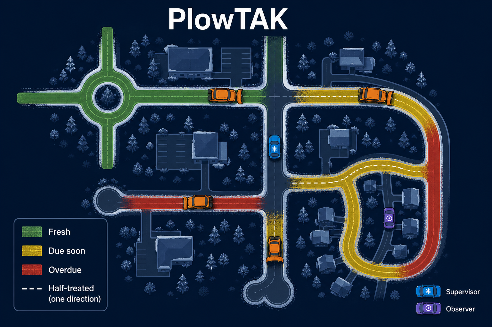
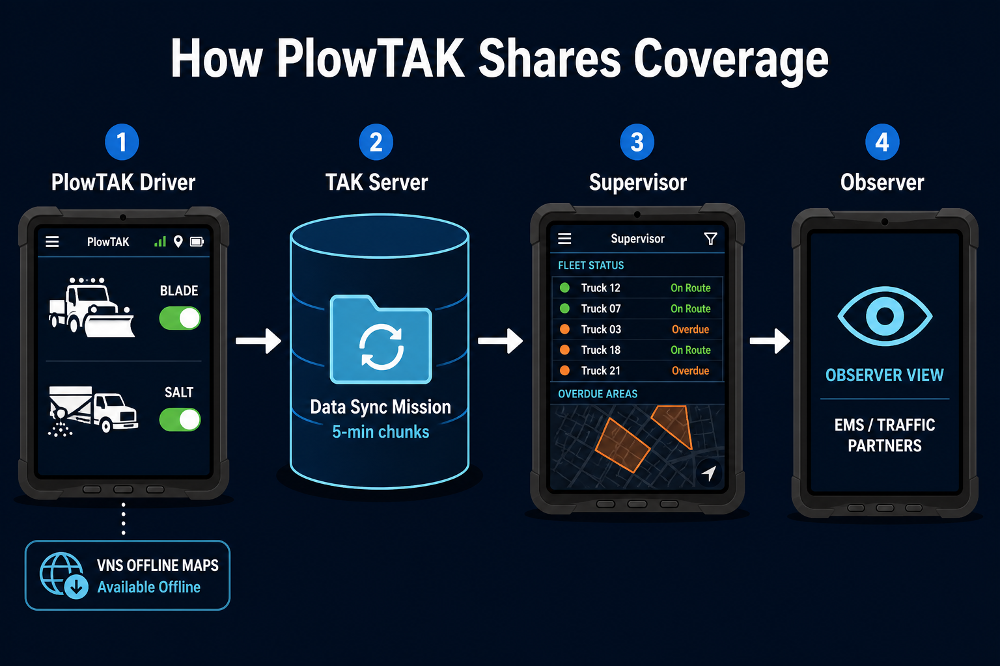
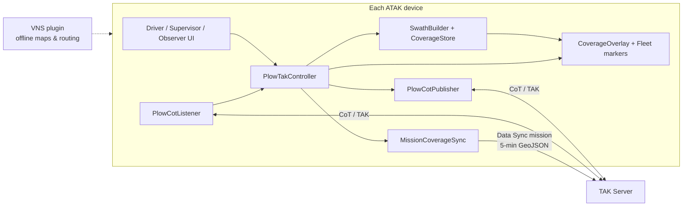
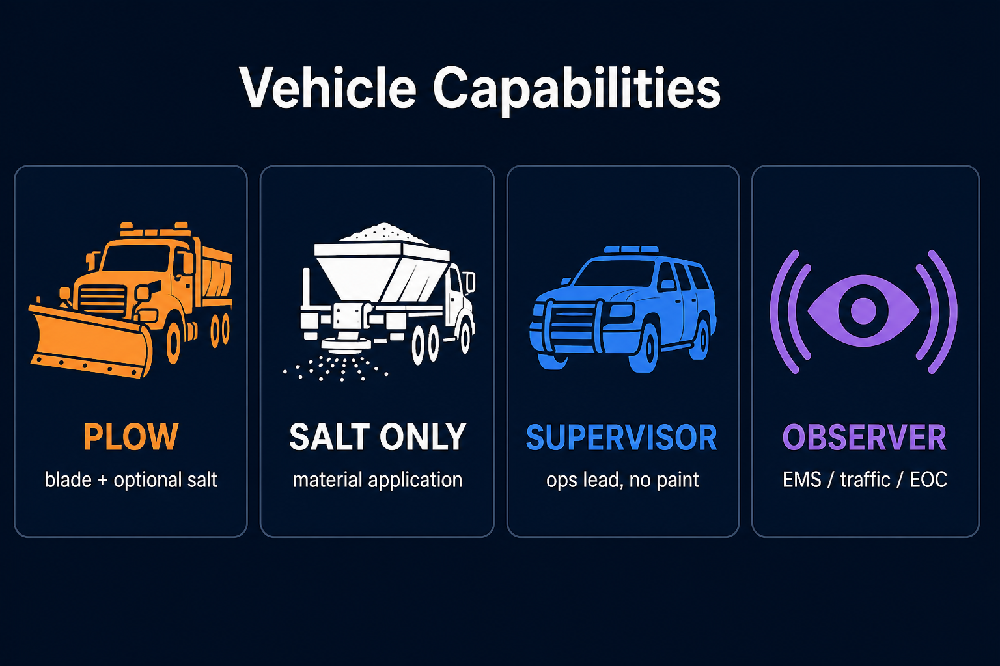
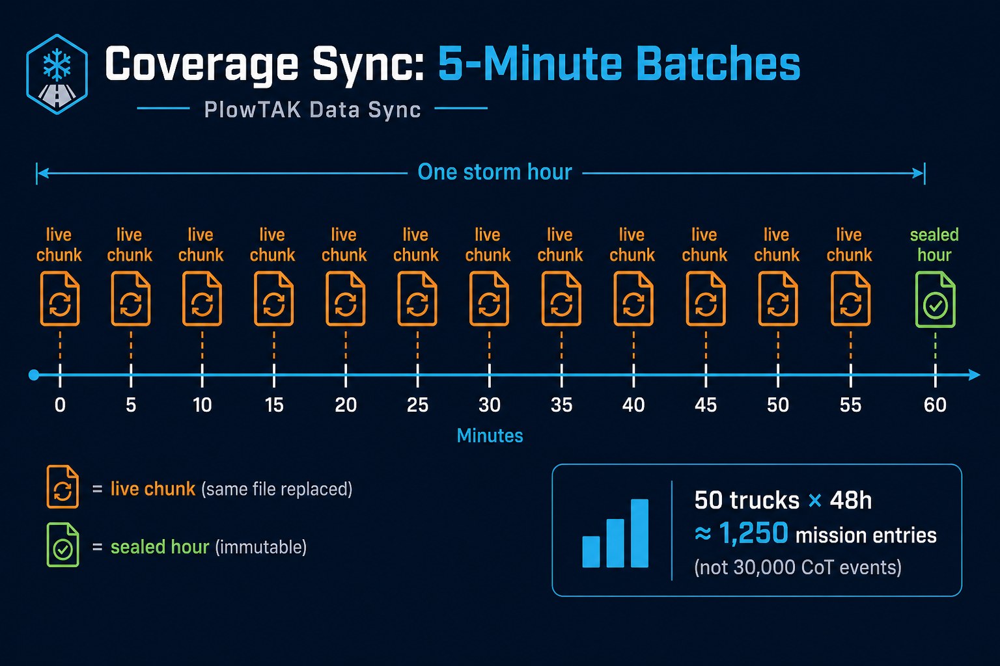
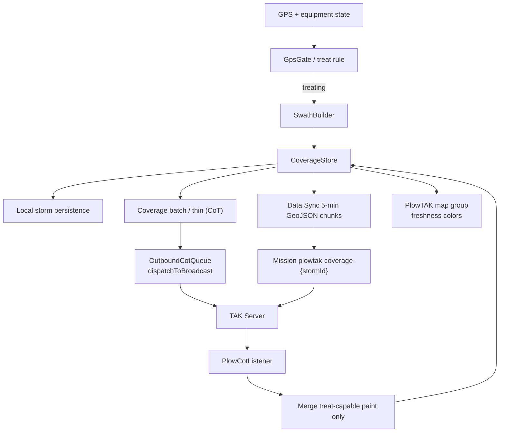

# PlowTAK

<p align="center">
  
</p>

**PlowTAK** is an ATAK plugin for winter road operations — snow plow fleet coverage
tracking over TAK Server. Published by **CopIX**.

Every plow publishes its live position and equipment state (blade down, spreader on).
Every other plow, supervisor, and observer on the same TAK Server sees **where roads
have been treated in the last X minutes**, which priority segments are overdue, plow
direction/side of road, and emergency (distress) alerts — with offline maps and
routing provided by the VNS plugin.



## Architecture





## Roles

One APK, four per-device roles (chosen in settings on first run):



| Type | Who | Publishes PLI | Records coverage | Equipment toggles |
|------|-----|---------------|------------------|-------------------|
| **Plow** | Blade truck (optionally with spreader) | Yes | Yes, when treating | Blade; Salt if equipped |
| **SaltOnly** | Spreader / brine truck, no blade | Yes | Yes, when material on | Salt/material only |
| **Supervisor** | Ops lead driving or checking routes | Yes (non-treating) | No | None (inspection mode) |
| **Observer** | Responders, traffic control, EOC viewers | Optional | No | None (read-only) |

## Data flow & coverage sharing

Coverage and ops events ride standard TAK Cursor-on-Target with a `<__plowtak>`
detail namespace (double-underscore custom detail per TAK CoT guidance). Live PLI
stays frequent; **coverage is batched and thinned over CoT** (~20s drain from the
local store). While a storm is active, **TAK Data Sync** also uploads **5-minute
GeoJSON mission chunks** to `plowtak-coverage-{stormId}` so late-joining
supervisors can catch up without replaying every live CoT.





## Feature summary

- **Capability-gated UI** — glove-friendly Blade/Salt toggles, distress, hazards,
  road conditions; supervisor storm session, cycle times, zones, tasking, route
  assign/clear, export; observer read-only fleet/alerts.
- **Swath recording** — treat-rule gated segments with heading, material, width;
  GPS quality gate, thinning, optional GraphHopper road-snap.
- **Freshness map** — "PlowTAK" map group colored by age vs cycle time (green /
  yellow / red), direction-aware half-treated rendering, priority/zone overrides.
- **Fleet CoT** — PLI with `<__plowtak>` (MarkerDetailHandler), batched coverage
  (`b-i-x-plowtak-*`), storm sessions, distress (911-alert convention), tasks,
  zones, conditions.
- **Hazard photos** — long-press a hazard button to capture via ATAK **QuickPic**;
  photo attaches to the hazard marker for TAK attachment sync.
- **Data Sync** — 5-minute gzip GeoJSON coverage uploads to a per-storm mission
  while the storm is active (fail-open if Data Sync / server unavailable).
- **Bluetooth equipment** — optional paired plow/spreader controller (MAC + BLE
  flag in Vehicle setup / Tool Preferences) drives blade/salt state.
- **Task GeoChat** — supervisor tasking also pings the target contact via ATAK
  GeoChat when the contact is known.
- **Ops hardening** — forgot-to-toggle nudges, voice alerts, night palette, shift
  login, facility geofences, post-storm GeoJSON/CSV export, live metrics.
- **Offline continuity** — durable outbound CoT queue (disk-backed) + local
  coverage re-share after restart; foreground shift service through doze; VNS for
  offline basemap/routing.
- **Tool Preferences** — ATAK Tools → PlowTAK for TTS, direction-aware coverage,
  and Bluetooth toggles.

See [docs/ops-guide.md](docs/ops-guide.md) and
[docs/cot-schema.md](docs/cot-schema.md) (`<__plowtak>` schema).

## Requirements

- **Host:** ATAK-CIV **5.8.x** on Android. Plugins are version-locked: a PlowTAK APK
  built against the 5.8 SDK only loads in ATAK-CIV 5.8.
- **Peer dependency:** **VNS plugin 4.0** (Vehicle Navigation System) for offline
  basemaps/routing. Download from [tak.gov](https://tak.gov) — not redistributed
  here. PlowTAK does not call private VNS APIs.
- **TAK Server** connectivity for fleet sharing (PlowTAK keeps recording offline and
  syncs when connectivity returns). Data Sync mission chunks require a server with
  Data Sync / mission support enabled.

## Building

The ATAK SDK is required and is **not** included in this repository.

1. Download the **ATAK-CIV 5.8 SDK** from [tak.gov](https://tak.gov) (registration
   required). You need:
   - `main.jar` — the ATAK API (`compileOnly`)
   - `atak-gradle-takdev.jar` — TAK dev Gradle plugin (offline fallback)
2. Copy `local.properties.example` to `local.properties` and set `sdk.dir`,
   `sdk.path`, `takdev.plugin`, and signing keystore keys (see the example file).
3. Build with JDK 17:

   ```powershell
   .\gradlew assembleCivDebug
   ```

   Release APK name:
   `ATAK-Plugin-PlowTAK-<version>--5.8.0-civ-release.apk`

4. Install a **TAK Product Center–signed** APK (from a GitHub Release marked
   TPC/user_builds, or your own takrepo-signed `assembleCivRelease`), then
   enable it in ATAK's Plugins manager. A CopIX-only CI signature will show
   “signature INVALID” on release ATAK-CIV — see [docs/ci-build.md](docs/ci-build.md).

Framework-free engine tests (no ATAK SDK):

```powershell
.\gradlew.bat -p coretests test
```

## Offline map packs

Dev GraphHopper packs for **North Carolina**, **Tennessee**, and **Virginia** live
in `Maps/` locally but are **not tracked in git** (~489 MB); they ship as **GitHub
Release assets**. Device install steps: [docs/vns-install.md](docs/vns-install.md).

> Production agencies should generate fresh GraphHopper extracts for their AOR.

## Docs

| Doc | Contents |
|-----|----------|
| [docs/ops-guide.md](docs/ops-guide.md) | Operator guide (roles, coverage colors, distress) |
| [docs/cot-schema.md](docs/cot-schema.md) | `<__plowtak>` CoT detail schema |
| [docs/vns-install.md](docs/vns-install.md) | VNS / GraphHopper pack install |
| [docs/ci-build.md](docs/ci-build.md) | GitHub Actions APK build + required secrets |
| [docs/tpc-signing.md](docs/tpc-signing.md) | TAK Product Center / user_builds signing handoff |
| [CHANGELOG.md](CHANGELOG.md) | Release history |

## CI / Releases

Push to `main` runs engine tests and, when secrets are configured, builds a signed
CIV release APK and publishes a GitHub Release (`build-0.1.<n>`). Setup guide:
[docs/ci-build.md](docs/ci-build.md).

## License

[PlowTAK Free Application License 1.0](LICENSE) — © 2026 CopIX LLC.

Same terms as [WinTAKTracker](https://github.com/CopIXus/WinTAKTracker): free to
use; source stays available; do not sell the application itself. Solution
providers may charge for install/support time.
