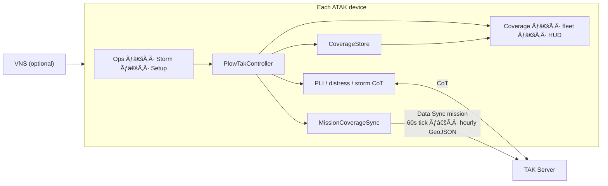
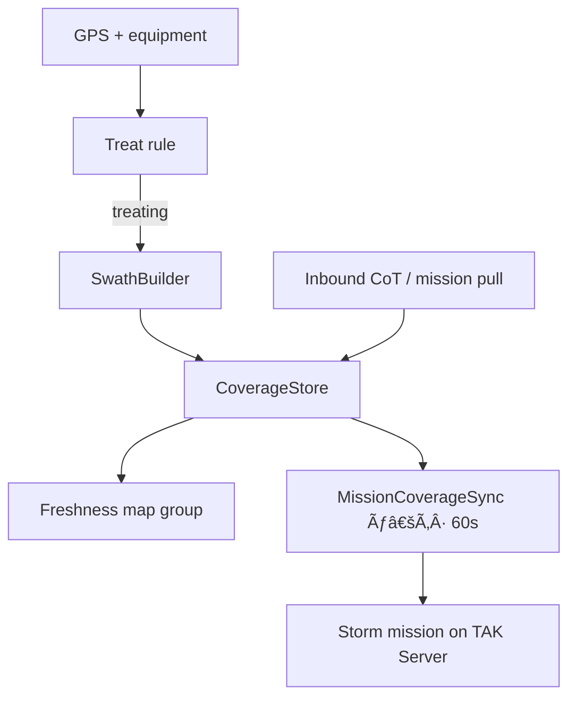

# PlowTAK

<p align="center">
  
</p>

Winter road coverage for ATAK. Published by **CopIX**.

**Install.** Use a TPC-signed APK. A CopIX-only CI build shows “signature INVALID” on release ATAK.

Pick the APK that matches the ATAK-CIV version on the device. One plugin cannot
load on all three lines. 5.6 and 5.7 are not on this release yet.

<!-- plowtak-release-links:start -->
- ATAK-CIV 5.6: [PlowTAK-26.1019.1743-ATAK-5.6.0-civ-release.apk](https://github.com/CopIXus/PlowTAK/releases/download/tpc-0.1.10/PlowTAK-26.1019.1743-ATAK-5.6.0-civ-release.apk)
- ATAK-CIV 5.7: [PlowTAK-26.1019.1743-ATAK-5.7.0-civ-release.apk](https://github.com/CopIXus/PlowTAK/releases/download/tpc-0.1.10/PlowTAK-26.1019.1743-ATAK-5.7.0-civ-release.apk)
- ATAK-CIV 5.8: [PlowTAK-26.1019.1743-ATAK-5.8.0-civ-release.apk](https://github.com/CopIXus/PlowTAK/releases/download/tpc-0.1.10/PlowTAK-26.1019.1743-ATAK-5.8.0-civ-release.apk)
<!-- plowtak-release-links:end -->

<p align="center">
  
</p>

<p align="center"><em>On shift: map HUD, blade / spreader, material, unit status, hazards, road conditions, Mayday.</em></p>

## What it does

**Field install:** download the **TPC-signed** APK that matches the device
(ATAK-CIV 5.6, 5.7, or 5.8) from
[Releases / tpc-0.1.9](https://github.com/CopIXus/PlowTAK/releases/tag/tpc-0.1.9),
install, then Plugins → PlowTAK → **Load**. CopIX-only CI builds show
“signature INVALID” on release ATAK — use a `tpc-*` release for Load.

Treat-capable trucks paint where roads were worked; peers on the same TAK
Server see freshness-colored coverage, fleet status, Mayday, hazards, and
conditions. Storms are **joined explicitly** (never auto-joined). Catch-up for
late joiners rides **TAK Data Sync** missions via Marti — the on-device Data
Sync plugin is not required for PlowTAK’s upload path. Offline maps/routing
come from the optional **VNS** plugin.

---

## What’s in the panel

One ops drop-down for every vehicle type, plus **Storm** and **Settings**:

| Area | What you get |
|------|----------------|
| **Shift** | Login / end shift; presence while on duty |
| **Plow control** | L wing · blade · R wing · spreader (capability-gated) |
| **Material** | Salt, sand, gravel, brine, pre-wet |
| **Unit status** | Driving, loading, refueling, on break, out of service |
| **Hazards** | One-tap report; **long-press → QuickPic** photo on the marker |
| **Road conditions** | Bare / wet / slush / snow-covered / ice · peer labels · stale TTL (default **2 h**) |
| **Mayday** | Distress with location + last equipment state |
| **Storm** | Pick TAK server, create / join / leave / end · mission stays on server |
| **Settings** | Vehicle type, widths, TTS, **map HUD**, condition TTL, road-snap, Bluetooth |
| **Map HUD** | Mini plow under the menus while on shift (panel closed) |

<p align="center">
  
</p>

<p align="center"><em>Map HUD while on shift (panel closed): Mayday, wings / blade, tow, spreader, hazard / road, plus nearby treat tasks.</em></p>

---

## Architecture



```mermaid
flowchart LR
  subgraph Device["Each ATAK device"]
    UI["Ops · Storm · Setup"]
    Ctrl["PlowTakController"]
    Store["CoverageStore"]
    Cot["PLI / distress / storm CoT"]
    Sync["MissionCoverageSync"]
    Map["Coverage · fleet · HUD"]
    UI --> Ctrl
    Ctrl --> Store
    Ctrl --> Cot
    Ctrl --> Sync
    Ctrl --> Map
    Store --> Map
  end
  Cot <-->|"CoT"| TAK["TAK Server"]
  Sync -->|"Data Sync mission<br/>60s tick · hourly GeoJSON"| TAK
  VNS["VNS (optional)"] -.-> Device
```

---

## Vehicle types

One APK. Pick type in **Settings** (first run / Vehicle setup):


| Type | Who | Publishes PLI | Paints coverage | Equipment |
|------|-----|---------------|-----------------|-----------|
| **Plow** | Blade truck (± spreader) | Yes | Yes, when treating | Blade / wings; salt if equipped |
| **SaltOnly** | Spreader / brine, no blade | Yes | Yes, when material on | Spreader + material |

Every unit uses the same **Ops · Storm · Settings** panels. Any device can
**create, join, leave, or end** a storm — there is no separate supervisor or
observer role.

---

## Storms & Data Sync

<p align="center">
  
</p>

<p align="center"><em>Storm / Data Sync: pick server and channel, join or create a storm, leave without deleting the mission.</em></p>


- Remote storms are **heard but not auto-joined** — pick `Agency · Designator · id`.
- **Create** opens a Marti mission (storm label, or `plowtak-coverage-{stormId}`).
- While joined, PlowTAK syncs about **every 60 seconds** (hash-skip if unchanged):
  `storm-config.json`, hourly coverage `.geojson.gz`, hazards, conditions,
  unit status.
- **Leave** stops reporting; **End** ends the storm for the fleet.
- The Data Sync **mission is never deleted from the plugin** — only a server
  admin removes it (so mid-storm data cannot be wiped by accident).
- Preferred server: Settings / Storm → Data Sync server (`plowtak.datasync.server`).
- Uploads are **fail-open** if Marti / the server is unavailable.

Live **CoT** still carries PLI, distress, and storm announce. Coverage catch-up
is **Data Sync–first**.


```mermaid
flowchart TB
  GPS["GPS + equipment"] --> Gate["Treat rule"]
  Gate -->|treating| Swath["SwathBuilder"]
  Swath --> Store["CoverageStore"]
  Store --> Map["Freshness map group"]
  Store --> Sync["MissionCoverageSync · 60s"]
  Sync --> Mission["Storm mission on TAK Server"]
  CotIn["Inbound CoT / mission pull"] --> Store
```

---

## Coverage map

<p align="center">
  
</p>

| Color | Meaning |
|-------|---------|
| **Green** | Treated within the storm cycle time |
| **Yellow** | Aging / due soon (75% of cycle) |
| **Red** | Overdue past the cycle — **stays on the map** unless the storm sets a clear window |

Cycle time, P1/P2/P3, and coverage clear-after hours are **storm-level** (shared via
`storm-config.json` / CoT). Default clear-after is **0** (never drop; stay red).
Edit under **Storm → Storm coverage settings…** or seed via an `ipprov.json`
provisioning datapackage (`cycleTimes`, `coverageRetentionHours`,
`roadConditionTtlMinutes`). Device Settings hold defaults for the next storm only.

Data Sync GeoJSON coverage files carry the same stroke color so peers without
PlowTAK still see green / yellow / red (not a default black line).

Direction-aware half-treated lines show one travel direction painted.

## Vehicle types and roles

<p align="center">
  
</p>

- **Glove UI** — large plow/material/status tiles, night palette, TTS nudges.
- **Map HUD** — mini plow under menus; toggle in Settings (`plowtak.map_hud_enabled`).
- **Hazards & conditions** — labeled for peers (`Type (callsign)` /
  `Ice (Unit 14:35)`); condition stale TTL default **120 minutes**.
- **QuickPic hazards** — long-press a hazard tile to attach a photo.
- **Data Sync storm missions** — create/join/leave/end without requiring the
  Data Sync plugin for PlowTAK’s Marti path; no in-app mission delete.
- **Fleet markers** — stale grey-out.
- **Bluetooth equipment** — optional paired controller for blade/salt.
- **Offline continuity** — durable outbound CoT queue; local coverage kept
  across restarts; shift foreground service; VNS for offline basemap/routing.
- **Tool Preferences** — ATAK Tools → PlowTAK (TTS, direction-aware coverage, BT).

PlowTAK reads the VNS offline routing pack already on the device. Untreated plow-class roads draw dim red, and road class sets P1, P2, or P3 cycle time. An agency GeoJSON or KML with `priority`, `lanes`, and `route_id` overrides the pack and is shared as `roads.geojson`. See [vns-install.md](docs/vns-install.md).

## Storms and Data Sync

<p align="center">
  
</p>

- Create, join, leave, or end a storm from the panel. End asks first.
- While joined, a tick about every 60 seconds uploads plain GeoJSON: `storm-config.json`, `<uid>-<hour>-live.geojson`, hazards, conditions, status, and ops.
- The mission is never deleted from the device.
- Pick the TAK server on the storm panel.
- Live position, distress, storm announce, and a short coverage burst also go out as CoT, and wait in a queue when no server is connected.

<p align="center">
  
</p>

<p align="center">
  
</p>

## Requirements

ATAK-CIV 5.6, 5.7, or 5.8, and the plugin APK built for that same line. A VNS GraphHopper pack is optional and recommended. No second road download.

## Building

Copy `template.local.properties` to `local.properties` and set `sdk.dir`. Do not commit `local.properties`. `scripts/build-atak.ps1` passes `sdk.path` and `takdev.plugin` for the line you build.

1. Download the **ATAK-CIV 5.6, 5.7, and 5.8 SDKs** from [tak.gov](https://tak.gov)
   into `T:\TAK` (or set `ATAK_SDK_ROOT`). A 5.8.0.1 extract satisfies 5.8.0.
2. Copy `template.local.properties` → `local.properties` (`sdk.dir`, and signing
   keys when you are not using the takdev debug keystore).
3. JDK 17:

   ```powershell
   .\scripts\build-atak.ps1 5.8.0
   .\scripts\build-atak.ps1 all
   ```

   Release names: `PlowTAK-<yy.mmdd.HHmm>-ATAK-5.6.0-civ-release.apk` (and
   `5.7.0`, `5.8.0`). `all` skips a line whose SDK is not on disk.

4. **Field devices** need a **TPC-signed** build:
   [tpc-0.1.9](https://github.com/CopIXus/PlowTAK/releases/tag/tpc-0.1.9)
   (`PlowTAK-26.0816.0002-ATAK-5.8.0-civ-release.apk`, job
   `amos-halava1-leo-gov-20260816-000156`). See
   [docs/tpc-signing.md](docs/tpc-signing.md) and
   [docs/tak-gov-submission.md](docs/tak-gov-submission.md) (lean source zip
   for the next tak.gov upload).

Engine tests (no ATAK SDK):

```powershell
.\gradlew.bat -p coretests test
```

## Docs

| Doc | Contents |
|-----|----------|
| [docs/ops-guide.md](docs/ops-guide.md) | Operator guide |
| [docs/cot-schema.md](docs/cot-schema.md) | `<__plowtak>` CoT schema |
| [docs/vns-install.md](docs/vns-install.md) | VNS / GraphHopper packs |
| [docs/ci-build.md](docs/ci-build.md) | GitHub Actions + secrets |
| [docs/tpc-signing.md](docs/tpc-signing.md) | TPC / user_builds signing |
| [docs/tak-gov-submission.md](docs/tak-gov-submission.md) | Lean tak.gov source zip |
| [CHANGELOG.md](CHANGELOG.md) | Release history |

## CI / Releases

Push to `main` does **not** build or publish APKs. Field installs come from
tak.gov TPC signing; publish a GitHub Release only after Success (`tpc-*` tags).
Unit tests run on PRs / manual workflow; optional CIV builds are
`workflow_dispatch` or `v*` tags only (developer ATAK, not field Load).

## License

See the repository license. Plugin APKs for the field are the TPC-signed releases.
